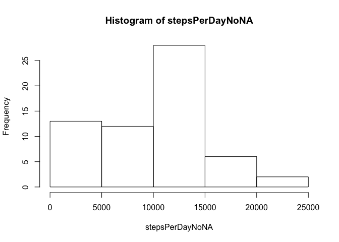

# Reproducible Research: Peer Assessment 1


## Loading and preprocessing the data
Load the data. No preprocessing necessary (though some processing is done in later steps).

```r
activity <- read.csv("activity.csv")
```


## What is mean total number of steps taken per day?
First, make a histogram showing the total number of steps per day:

```r
stepsPerDay <- with(activity, tapply(steps, date, sum, na.rm=TRUE))

hist(stepsPerDay)
```

<!-- -->

Then, calculate the mean steps per day:

```r
mean(stepsPerDay)
```

```
## [1] 9354.23
```

Then, calculate the median steps per day:

```r
median(stepsPerDay)
```

```
## [1] 10395
```


## What is the average daily activity pattern?
Make a time series plot of the average steps taken in each five-minute interval across all days:

```r
stepsPerInterval <- with(activity, tapply(steps, interval, mean, na.rm=TRUE))

plot(as.integer(names(stepsPerInterval)), stepsPerInterval, type="l", xlab="Interval", ylab="Average Steps")
```

<!-- -->

Then, find the interval that has the highest average number of steps:

```r
stepsPerInterval[which(stepsPerInterval==max(stepsPerInterval))]
```

```
##      835 
## 206.1698
```


## Imputing missing values
There are a lot of NAs. I'm going to make them go away. How many missing values do I have?

```r
actNoNA <- activity
avgSteps <- cbind(as.numeric(stepsPerInterval), as.integer(names(stepsPerInterval)))

missing <- which(is.na(actNoNA$steps)==TRUE)
length(missing)
```

```
## [1] 2304
```

That's a lot of missing values. I will find the interval associated with each NA, and replace that NA with the average for its interval (as calculated above):

```r
for(nat in missing) {
    actNoNA$steps[nat] <- avgSteps[which(avgSteps[,2]==actNoNA$interval[nat]),1]
}
```

Now, let's look at a histogram:

```r
stepsPerDayNoNA <- with(activity, tapply(steps, date, sum, na.rm=TRUE))
hist(stepsPerDayNoNA)
```

<!-- -->

And find the mean:

```r
mean(stepsPerDayNoNA)
```

```
## [1] 9354.23
```

And the median:

```r
median(stepsPerDayNoNA)
```

```
## [1] 10395
```

Because I used the average over all days for the interval of each missing value, there is no difference in the mean or median when I calculate the average number of steps per day.


## Are there differences in activity patterns between weekdays and weekends?

Do people behave differently on weekends? Let's find out!

First I need to turn the dates into real dates, and find the day of the week associated with each one:

```r
actNoNA$asADate <- strptime(actNoNA$date, "%Y-%m-%d")
actNoNA$day <- weekdays(actNoNA$asADate)
```

Then, I'll subset out the weekend and the weekdays and find the average value for each interval:

```r
weekdaySteps <- subset(actNoNA, !(actNoNA$day=="Saturday") & !(actNoNA$day=="Sunday"))
weekendSteps <- subset(actNoNA, (actNoNA$day=="Saturday") | (actNoNA$day=="Sunday"))

stepsDayEnd <- with(weekendSteps, tapply(steps, interval, mean, na.rm=TRUE))
stepsDayDay <- with(weekdaySteps, tapply(steps, interval, mean, na.rm=TRUE))
```

Finally, let's look at a plot of the weekend days and weekday days!

```r
par(mfcol=c(2,1))
plot(stepsDayEnd, type="l", xlab="Interval", ylab="Average Steps", main="Weekends")
plot(stepsDayDay, type="l", xlab="Interval", ylab="Average Steps", main="Weekdays")
```

<!-- -->


Such fun!
